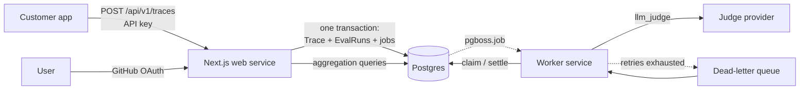

# Eval Platform — LLM Evaluation & Observability

A multi-tenant platform for logging LLM calls and evaluating them automatically. Teams send
traces to an ingestion API; a background worker runs configurable evaluators against each
trace — deterministic assertions and LLM-as-judge — and the dashboard surfaces cost, latency
percentiles, and quality trends per project.

**Live:** https://eval-production-fd70.up.railway.app

 to the
ingestion API using a project API key. In a single database transaction the platform stores
the trace, creates one `EvalRun` row per active evaluator, and enqueues a job for each — so a
trace can never exist without its evaluations, and jobs can never exist for a trace that
rolled back.

A separate worker process drains the queue. Each job claims its `EvalRun` with a conditional
update, runs the evaluator, and settles the row. Deterministic evaluators (non-empty, max
length, regex, JSON-valid) run locally; `llm_judge` evaluators call a language model with a
rubric and parse a structured score and reasoning. Transient failures retry with jittered
exponential backoff; permanent failures settle immediately; jobs that exhaust their retries
are dead-lettered and marked failed.

The dashboard aggregates all of it — trace volume, spend, token usage, p50/p95/p99 latency,
per-evaluator pass rates, and retry health — scoped to the organizations the signed-in user
belongs to.

---

## Architecture



**Two services, one repository, different entry points.** The web service answers HTTP
requests and must return quickly. The worker is a long-lived process that polls the queue —
it has no HTTP surface at all. That split is why this runs on Railway as two services rather
than on a serverless platform, which can host the first but not the second.

The queue lives in the same Postgres as the application data (pg-boss), which is what makes
transactional enqueue possible at all.

### Data model

```
User → Membership → Organization → Project → { ApiKey, Trace, Evaluator }
                                                 Trace × Evaluator → EvalRun
```

Every row traces back to exactly one organization. Isolation is a property of the schema
rather than something enforced query by query.

### Stack

TypeScript · Next.js (App Router) · Postgres · Prisma · pg-boss · Auth.js · Recharts ·
deployed on Railway with Neon Postgres

---

## Key engineering decisions

### 1. Transactional enqueue solves the dual-write problem

Writing the trace and enqueueing its jobs are two operations. A crash between them leaves a
trace with no evaluations, or jobs pointing at a trace that never committed — the classic
dual-write problem, and normally it requires an outbox table to solve.

Because pg-boss stores jobs as rows in the same Postgres, `fromPrisma(tx)` routes the job
inserts through the application's own transaction. Trace, `EvalRun` rows and queue jobs all
commit or roll back together.

*Verified:* a forced failure mid-transaction leaves zero rows in `Trace`, zero in `EvalRun`,
**and zero in `pgboss.job`**. The third is the interesting one — it would be impossible with
Redis-backed queueing.

*Tradeoff:* couples the queue to the primary database, capping throughput well below what a
dedicated broker would reach. At this scale, the correctness guarantee is worth more.

### 2. Idempotency as a state machine, not an exception catch

Queue delivery is at-least-once, so the same job will eventually arrive twice. The worker
claims an `EvalRun` with a conditional update that only matches `queued` or `running`:

```ts
const claimed = await db.evalRun.updateManyAndReturn({
  where: { traceId, evaluatorId, status: { in: ["queued", "running"] } },
  data: { status: "running", attempts: { increment: 1 } },
});
if (claimed.length === 0) return;   // already settled — redelivery is a no-op
```

`done` and `failed` are terminal, so a redelivered job matches zero rows and returns cleanly.
Not a duplicate write, not an error.

`running` is deliberately claimable: if the worker dies mid-job the row is stranded in
`running`, and excluding it would deadlock that evaluation forever.

A unique constraint on `(traceId, evaluatorId)` backs this at the database level — two
mechanisms guarding two different paths.

*Verified:* sending duplicate jobs for a settled `EvalRun` produces `skip (already settled)`
and leaves exactly one row, with `attempts` unchanged.

### 3. Classify errors before deciding to retry

A rate limit is worth retrying — the same request will likely succeed shortly. A malformed
evaluator config will fail identically forever, and retrying it wastes time, money, and
pollutes the metrics.

Errors are classified as transient (429, 5xx, network faults) or permanent (4xx, invalid
config, missing rows). The worker's control over retries is expressed entirely through
whether the handler throws:

- **Permanent** → settle as `failed` and `return`. No retry.
- **Transient** → leave the row in `running` and `throw`, so pg-boss retries with backoff.

Unknown errors **default to permanent**. The costs are asymmetric: wrongly retrying means a
storm against something already broken, while wrongly failing means one evaluation to re-run
by hand.

Backoff is exponential with equal jitter (`retryDelay: 2`, capped at 60s), so simultaneous
failures don't synchronize their retries.

### 4. `batchSize: 1` for failure isolation

pg-boss treats a batch as a single unit of work — if one job in a batch of five throws, all
five are marked failed and retried. Idempotency makes the reruns harmless, but the accounting
is wrong: four healthy evaluations counted as failures, consuming retry budget for another
job's error.

Throughput traded for correct failure attribution.

### 5. Two API planes with different auth

- **Ingestion** (`/api/v1/*`) — machine-to-machine, bearer API key, derives `projectId` from
  the key.
- **Application** (pages, `/api/projects/*`) — session auth via GitHub OAuth, derives
  organization membership from the signed-in user.

Different callers, different credentials, one tenancy invariant.

API keys are stored as SHA-256 hashes with a short non-secret prefix for lookup. A fast hash
rather than bcrypt is correct here — the keys are 24 random bytes, so the high-entropy threat
model that makes slow hashing valuable for passwords doesn't apply.

### 6. A single tenant-scoped data access layer

In a shared-schema multi-tenant system, one forgotten `WHERE` clause is a data breach. Rather
than relying on remembering, every application-plane query goes through one `TenantScope`
class whose methods already carry the organization filter. `db` is never imported directly
into a page — so "is this leak-free?" is answerable by grep rather than by audit.

Organization IDs come from the session, never from a request parameter. Accepting an `orgId`
query param would make the server a confused deputy: it has legitimate access to everything,
so it must not take instructions about what to access from the caller.

Aggregation queries use raw SQL, which bypasses those guarantees — so they live on
`TenantScope` behind an `assertProject()` call. Parameterization stops injection; it does
nothing about tenancy. A perfectly parameterized query against the wrong project is still a
breach.

**Cross-tenant requests return 404, not 403.** A 403 confirms the resource exists, which is
itself a leak.

*Verified:* a signed-in member of one organization requesting another's project, traces, or
metrics gets 404 on every route.

### 7. Pluggable judge provider

`JudgeProvider` is a three-member interface returning parsed JSON. Each implementation owns
its own structured-output mechanism — the Gemini provider uses `responseSchema`; an Anthropic
provider would use tool use — and callers don't care which. Switching judges is one
environment variable.

The judge prompt puts **reasoning before score** in both the system prompt and the response
schema, following the G-Eval finding that models score better after reasoning than when
emitting a number cold. The rubric explicitly instructs the judge to ignore output length, a
direct mitigation for the verbosity bias documented in the MT-Bench paper.

### 8. Evaluator registry

Evaluators are `{ type, configSchema, run }` objects in a registry, with config validated by
zod at execution time. Adding a new evaluator type is one file plus one registry line — no
changes to the worker, the queue, or the schema. Invalid config raises a `PermanentError`, so
a bad rubric fails once rather than three times.

---

## Debugging story: a 15-second transaction

Worth recording because the first hypothesis was wrong.

**Symptom.** Transactions taking 15 seconds in development. Concurrent requests failing with
Prisma `P2028` — unable to start a transaction in the given time.

**First hypothesis: connection exhaustion.** Plausible — two processes, a hot-reloading dev
server leaking pools, a hosted database with a connection ceiling.

**Disproved by evidence.** `pg_stat_activity` showed 8 total connections against a much
higher limit. Not exhaustion.

**Actual cause.** Roughly 300ms round-trip latency between my location and the database
region, multiplied by ~20 sequential statements inside a single transaction (BEGIN, insert,
select, insert, several queue inserts, COMMIT). The latency had always been there; before
transactions were introduced each statement was independent and the cost was invisible. The
transaction made them serialize, and held a connection for the duration — so the next request
timed out waiting to acquire one.

**Fix.** Co-locate the services with the database on deployment.

| | Local (cross-continent) | Deployed (same region) |
|---|---|---|
| `POST /api/v1/traces` | ~15s | <100ms |

The lesson generalizes: chatty transactions over high-latency links are a trap, and the fix is
either fewer round trips or a closer database. Batching the queue inserts into a single
`boss.insert()` call would cut the statement count further and is on the roadmap regardless.

---

## Running locally

**Requirements:** Node 22+, a Postgres database, a Gemini API key.

```bash
git clone <repo>
cd eval-platform
npm install
cp .env.example .env     # fill in the values
npx prisma migrate deploy
npx prisma db seed       # prints an API key — copy it, it is shown once
```

Two processes, two terminals:

```bash
npm run dev      # web
npm run worker   # queue consumer
```

The worker is a **separate long-lived process**. Without it, traces are ingested and jobs are
queued but nothing evaluates them.

Post a trace:

```bash
curl -X POST http://localhost:3000/api/v1/traces \
  -H "Authorization: Bearer <key from seed>" \
  -H "Content-Type: application/json" \
  -d '{
    "name": "summarize",
    "input": "The Apollo program ran from 1961 to 1972...",
    "output": "The Apollo program (1961-1972) put twelve astronauts on the Moon...",
    "model": "claude-sonnet-4-6",
    "promptTokens": 1200,
    "completionTokens": 80,
    "latencyMs": 950
  }'
```

### Environment

| Variable | Purpose |
|---|---|
| `DATABASE_URL` | Pooled connection — application runtime |
| `DIRECT_URL` | Direct connection — migrations and pg-boss schema setup |
| `AUTH_SECRET` | Signs session JWTs (`npx auth secret`) |
| `AUTH_URL` | Public base URL — required in production |
| `AUTH_TRUST_HOST` | `true` behind a TLS-terminating proxy |
| `AUTH_GITHUB_ID` / `AUTH_GITHUB_SECRET` | GitHub OAuth app credentials |
| `GEMINI_API_KEY` | Judge provider key |
| `JUDGE_MODEL` | Judge model identifier |

The pooled/direct split matters: connection poolers don't support the prepared statements
Prisma's migration engine and pg-boss's schema setup rely on.

---

## API

### `POST /api/v1/traces`

Bearer API key. Validates, computes cost from tokens and a model price table, stores the
trace, and enqueues one evaluation job per active evaluator — all in one transaction.

```json
{ "id": "cmthc0agx0000msmk0834p0j1", "evalsQueued": 3 }
```

Returns **202 Accepted**, not 200 — evaluations run asynchronously.

Cost is computed server-side from token counts; it is never accepted from the caller.

### `GET /api/projects/:projectId/metrics?days=14`

Session auth. Returns time-bucketed volume and cost (empty days included), per-evaluator pass
rates, latency percentiles, and retry health. Range clamped to 90 days.

---

## Evaluators

**`assertion`** — deterministic. `non_empty`, `json_valid`, `contains`, `regex`,
`max_length`. Free, instant, catches structural problems only.

**`llm_judge`** — a rubric plus a pass threshold. Returns a 0–1 score with reasoning.
Catches semantic quality; costs money, adds latency, and is nondeterministic.

Running both is the point. An output can be non-empty, well-formed, under the length limit,
and completely unrelated to the input — only the judge catches that.

---

## Known limitations

- **Evaluators are configured via seed script**; there's no management UI yet.
- **Tenant isolation is application-layer.** Row-Level Security would move the filter into
  Postgres so a missed `WHERE` fails closed rather than open. Sketch:

  ```sql
  alter table "Trace" enable row level security;
  create policy trace_tenant_isolation on "Trace" using (
    "projectId" in (
      select p.id from "Project" p
      join "Membership" m on m."orgId" = p."orgId"
      where m."userId" = current_setting('app.current_user_id', true)
    )
  );
  ```

  Not implemented: it requires every read to run inside a transaction that sets the session
  variable, and care that the setting doesn't leak between connection-pool checkouts.
- **Roles exist but aren't enforced.** The schema has `owner`/`admin`/`member`; nothing checks
  them yet.
- **JWT sessions, so no instant revocation.** Chosen because Prisma cannot run in Next.js's
  edge runtime, which a database-backed session strategy would require.
- **No caching or materialized views** on aggregation queries. Fine at current volume; a
  daily rollup table is the obvious next step.
- **Dashboard screenshots use synthetic data** (~5,000 generated traces) alongside real
  judged traces. Synthetic rows are marked in the database.
- **Flat traces only** — no nested spans for multi-step chains.

---

## What I'd add next

1. **Judge calibration harness** — human labels on a sample, Cohen's kappa against the judge,
   agreement tracked over time. Answers the question an eval platform must answer: is the
   judge any good?
2. **Consistency evaluator** — run the same judge N times, report variance.
3. **Reconciler** — sweep evaluations stuck in non-terminal states with no live job, and
   re-enqueue. The safety net beneath the transaction.
4. **Evaluator management UI** — validation driven by each evaluator's registered zod schema.
5. **Published ingestion SDK** with batching and a `wrap()` helper that times and logs a call
   automatically.
6. **Row-Level Security**, now viable post-deployment where a per-query transaction costs
   microseconds.

---

## Screenshots

(docs/Screenshot 2026-09-19 233540.png)
----
(docs/Screenshot 2026-09-19 233553.png)

| | |
|---|---|
|  |  |
| A real LLM judge scoring a summary 1.00, reasoning that omitting crew names is appropriate for a concise summary | An evaluation after four attempts: retries exhausted, dead-lettered, settled as failed |
